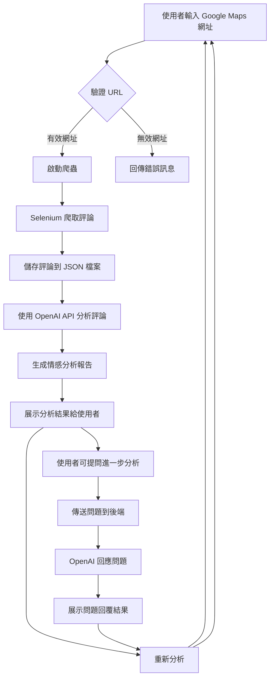

# 🛠️ Google Maps 評論分析

## 📌 簡介

Google Maps 是我們在外時經常會使用到的 App，且地標上的評論，可以供我們作為前往的參考依據。無論是餐廳、景點還是商家，消費者的評論中包含大量正面、負面或中性的內容，然而這些評論時常相互交織，導致用戶難以快速獲取有用資訊。

因此這個專案的目的是通過自動化工具爬取 Google Maps 評論，並使用自然語言處理技術嘗試「將主觀的評論，匯聚為客觀的分析」，從而幫助使用者更全面地理解評論內容。另外也提供了對話功能，允許使用者針對評論進行進一步提問，獲取特定的資訊，或實現更深入的分析。

<br>

## 📌 主要功能

- 自動爬取指定位置的 Google Maps 評論
- 基於自然語言處理的評論彙整分析
- 提供發問對話框進行延伸提問

<br>

## 📌 檔案結構及流程概念

此專案的目的是從 Google Maps 上指定地標的評論爬取評論並進行情感分析，最終結果會透過 Flask 技術呈現給使用者。另外亦提供發問功能，供使用者針對評論進行延伸提問。

<br>

檔案結構圖：

```
.
│
├── crawler.py
├── analysis.py
├── app.py
└── templates/
    ├── index.html
    └── result.html
```

<br>

運作流程圖：


<br>

以下針對各檔案功能進行說明：

- `crawler.py`：使用 Selenium 爬取指定地標的 Google Maps 評論並存儲為 JSON 檔案。
- `analyze.py`：讀取 JSON 檔案中的評論資料，並使用 OpenAI 模型進行情感分析。
- `app.py`：Flask 應用的後端，負責管理 HTTP 請求，調用爬蟲和分析程式，並處理使用者的問題。
- `templates/`：包含網頁模板，`index.html` 提供輸入 Google Maps 網址的介面，`result.html` 展示分析結果及使用者提問。


<br>

## 📌 環境設定及操作流程

1. 環境設定

    * Python 版本：確保系統已安裝 Python 3 以上版本。

    * 必需的 Python 套件：
    
        在專案目錄下執行以下指令安裝所需的 Python 套件。
        ```bash
        pip install -r requirements.txt
        ```

        requirements.txt 包含以下套件：<br>
        Selenium<br>
        Flask<br>
        OpenAI<br>
        dotenv

<br>

2. 環境變數設定

    * 將你的 OpenAI API 金鑰儲存在 .env 檔案中，內容如下：
        ```
        OPENAI_API_KEY=your-api-key
        ```

3. 設定 WebDriver 路徑

    * 請將專案中 crawler.py 中的 WEBDRIVER_PATH 變數更新為你 Chrome WebDriver 實際路徑。

4. 啟動 Flask 伺服器

    * 在專案目錄下，執行以下命令啟動 Flask 伺服器：
        ```bash
        python app.py
        ```

    * 伺服器將在 localhost:5000 上運行，你可以透過瀏覽器訪問此地址。

5. 使用操作

    * 進入首頁（localhost:5000），在輸入框中輸入 Google Maps 網址，並點擊「開始分析」。系統將自動執行以下操作：
        * 透過 Selenium 爬取指定地標的 Google Maps 評論。
        * 爬取完成後，自動分析這些評論，並將結果顯示在結果頁面上。

6. 評論分析

    * 當爬取完成後，系統會根據評論中的文字與星級評分，進行情感分析。該分析將綜合正面、負面與中立的評論，並生成一個簡短的結果彙整。
    * 使用者也可以透過對話框提問，系統將根據評論資料回應問題。

7. 重新分析

    * 若需重新爬取並分析其他地標的評論，可返回首頁或使用「重新分析」按鈕清除先前記憶，並開始新的分析。

<br>

## 📌 工作方法及技術細節

在這個 Google Maps 評論分析工具，雛形規劃階段是將工具的運作拆為三大部分：評論資料爬取、評論資料分析、操作介面設計。

在函式庫的運用上，評論資料的爬取採用 selenium；評論資料分析運用了 OpenAI 的 API，以及LangChain，處理多輪對話以及確保每個分頁的對話都是獨立的；後端串接採用 Flask。

然而在工作的進行上，是將「評論資料爬取」、「評論資料分析」、「操作介面設計」三個部分，分頭同步進行。

因為在技術的克服上難免會發生卡關的情形，這時候分頭同步進行能夠有效地推展工作，不會因為某個功能一時半刻沒有進展，而影響了其他部分的推進。以下提供三個部分在過程中遇到的一些技術問題。

<br>

### 🦎 評論資料爬取

* 處理不留言的評論
    - 因為 Google Maps 的評論機制，是規定需要留下評分，但評論內容是非必要的。
    - 因此不留言的部分需做例外處理（try、expect），確保爬取順利。

* 顯示評論全文
    - 在Google Maps 頁面結構中找到「全文」按鈕的元素，將評論內容完整展開。

* 處理不同語言的評論
    - 考慮到有些人瀏覽器的設定會是預設翻譯為繁體中文，因此需要點擊「查看原文」按鈕的元素。
    - 將評論一率恢復為原文。

<br>

### 🤖 評論資料分析

* prompt 的設計
    - 在使用 LLM 上， prompt 的技巧對於最終結果的呈現有十分顯著的影響。
    - 以下提供 prompt 的設計：
    ```
    請你秉持著公正客觀的精神，根據評論者表述的具體內容，不加入額外的情感或評價，彙整所有評論
        - 你必須考量到不同面向（譬如正面、負面以及中立的評論）進行彙整，如發現評論包含多重情緒面向，請確保每個面向都被分別處理，最後得出一個綜合的結果（切勿列舉出個別評論）；當然，畢竟一個場域同時存在不同的因素，影響使用者（或消費者）對於該地的觀感，也因此一個留言中難免會同時包和正面及負面的評價

        - 評論者有時候會善於利用反諷的方式表達他的想法，也請你試著去識別這些隱含在表面下的真實意義；若發現反諷或隱含的意思，請基於上下文和語調進行合理推測，並標註此為推測性的分析
        - 這些評論者可能來自不同國家，因此可能包含了許多不同的語言；也因此，你需要克服不同語言的問題，有些部分可能會較為口語化，你必須瞭解這些口語用法的真實意義；假使遇到不確定的語言表達或翻譯困難時，請明確標注為翻譯模糊部分，而非自行填補內容
        - 有些評論者可能偏好加入 emoji，或是顏文字，也請你嘗試辨別出來它們所代表的意義；若 emoji 的意義存在歧義，請提供多種可能的解釋，並根據評論的上下文推測最可能的含義
        - 另外你的分析也需要考量到同一則評論的星星數，譬如有的客人可能只會留言：青醬義大利麵；這就會取決於他給的星星數，給一顆星跟給五顆星，代表著是對這個餐點有非常不同的評價；換句話說，如果缺乏評論文字、評論太過簡短或表述不明確，則以星星數作為輔助判斷該評論者的滿意度
        - 留言的時間點也反應了該地標的時間變化，因此近一步你可以考慮分析近期的狀況，和較為早期的狀況；請分析評論的時間分布，並嘗試識別該地標的評價是否隨時間呈現趨勢變化
        - 請根據我提供的資料進行分析，回覆必須嚴格基於提供的資訊。若資料不足以進行詳細分析或形成結論，請明確指出，而不是捏造假設或擴展的情境。我期望的是實事求是的回應，即便資料有限，也不應基於假設情境進行推斷；如發現評論數量不足以得出有意義的結論，請清楚說明分析限制

        - 請逐一檢視每則評論，並根據語境進行判斷，而非僅根據關鍵字進行機械式分類，接著才著手進行彙整
        - 請以繁體中文回覆
        - 除了數字標號的內容外，請勿回覆多餘的內容
        - 請幫我彙整出約1200字的回覆
        最後，請你幫我結果整理成幾個部分，並按照我提供的數字標號自行分段：
        1.正面評論
        2.負面評論
        3.中性評論
        4.綜合討論
    ```

* 記憶前後文
    - 使用者每次發送問題時，系統會查找之前的對話記錄，參照目前的問題和之前的對話歷史，確保回覆的內容具備上下文關聯性。

* 不同分頁的對話內容互相干擾
    - 以亂數隨機產生 session_id ，確保每個分頁的對話記錄都能夠單獨管理，避免互相干擾。

<br>

### 🎮 操作介面設計

* 限制輸入網址類型
    - 接受 https://www.google.com/maps 、 https://maps.app.goo.gl 、 https://maps.google.com 這幾種網址類型。
	- 不同國家網域的Google Maps（譬如.tw、.jp...）也能接受。
    - 提供網址沒有 https 則會自動加上。

* 執行進度的更新
    - 提供使用者執行階段動態，提升用戶體。
    - 顯示「正在爬取評論，請稍候...」、「正在分析，請稍候...」等狀態。

<br>

### 🔍 發現

* 可以利用現有的一些想法，提供給生成式 AI 請它建議強化原有的邏輯，進而重新代入測試。
* 生成式 AI 在樣本數不足的情況下會不懂裝懂，捏造數據，因此需要在提示中給予限制。

<br>

## 📌 版本資訊

### v1.0

目前 v1.0 所具備功能，乃藉由提供 Google Maps 網址，針對地標上的評論進行爬取並進行情感分，並將條列式彙整結果呈現給使用者，另亦也提供延伸發問的功能。

<br>

### 未來考慮精進功能

* 爬取評論時加入爬取進度條
* 將 Google Maps 嵌入首頁頁面
* 支援不同的模型測試，如： Claude、LLaMA、BLOOM...
* 針對延伸提問的 prompt 進行調整，提升回覆的精準度
* 目前不同的 LLM ，有 token 的上限限制，可考慮摘要評論等方式避免超過上限
* 提升爬蟲的效率，以及超過2000則以上的評論可能有爬取不完全的情形（與頁面滾動展開時間過長有關）。