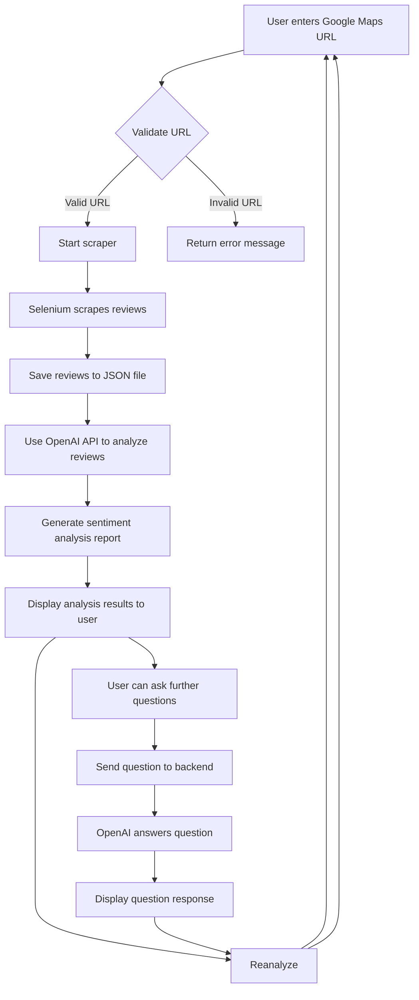

# 🛠️ Google Maps Review Analysis

## 📌 Introduction

Google Maps is an app that we frequently use when on the go. The reviews on landmarks can serve as references for us before visiting a place. Whether it's a restaurant, attraction, or business, the reviews contain a wealth of positive, negative, or neutral content, but these reviews are often mixed, making it difficult for users to quickly obtain useful information.

The purpose of this project is to automate the process of scraping Google Maps reviews and to use natural language processing techniques to "aggregate subjective reviews into an objective analysis" to help users better understand the content of the reviews. Additionally, it provides a conversation feature, allowing users to ask further questions about the reviews to get specific information or deeper analysis.

## 📌 Key Features

- Automatically scrape Google Maps reviews for a specified location
- Aggregated review analysis using natural language processing
- Provide an interactive dialog box for extended questions

## 📌 File Structure and Flow Concept

The purpose of this project is to scrape reviews from a specified Google Maps location and conduct sentiment analysis on the reviews. The final results are presented to users using Flask technology, with an additional Q&A feature for extended inquiries.

File structure:

```
.
│
├── crawler.py
├── analysis.py
├── app.py
└── templates/
    ├── index.html
    └── result.html
```

Flow diagram:



Description of each file:

- `crawler.py`: Uses Selenium to scrape Google Maps reviews for a specified location and stores them as a JSON file.
- `analysis.py`: Reads review data from the JSON file and uses the OpenAI model for sentiment analysis.
- `app.py`: Backend of the Flask application, handles HTTP requests, invokes the scraper and analysis scripts, and processes user questions.
- `templates/`: Contains HTML templates. `index.html` provides an interface for inputting Google Maps URLs, while `result.html` displays the analysis results and user questions.

## 📌 Environment Setup and Instructions

1. Environment Setup
   - Python version: Ensure Python 3 or above is installed.

   - Required Python packages:

     Run the following command in the project directory to install required Python packages:

     ```bash
     pip install -r requirements.txt
     ```

     The `requirements.txt` file includes: Selenium Flask OpenAI dotenv

2) Environment Variables Setup

   - Store your OpenAI API key in a `.env` file with the following content:
     ```
     OPENAI_API_KEY=your-api-key
     ```

3) Set WebDriver Path

   - Update the `WEBDRIVER_PATH` variable in `crawler.py` to the actual path of your Chrome WebDriver.

4) Start Flask Server

   - Run the following command in the project directory to start the Flask server:

     ```bash
     python app.py
     ```

   - The server will run on `localhost:5000`, which you can access using your browser.

5) How to Use

   - Go to the homepage (`localhost:5000`) and input the Google Maps URL in the text box, then click "Start Analysis". The system will automatically:
     - Use Selenium to scrape reviews for the specified Google Maps location.
     - After scraping, analyze the reviews and display the results on the results page.

6) Review Analysis

   - After scraping, the system will perform sentiment analysis on the reviews based on the text and star ratings. The analysis will combine positive, negative, and neutral reviews to generate a summarized result.
   - Users can also ask questions in the dialog box, and the system will respond based on the review data.

7) Reanalyze

   - To scrape and analyze reviews for another location, return to the homepage or use the "Reanalyze" button to clear previous data and start a new analysis.

## 📌 Working Methods and Technical Details

In this Google Maps review analysis tool, the concept is divided into three main parts: review data scraping, review data analysis, and interface design.

For library usage, Selenium is used for scraping review data, OpenAI's API is used for review analysis, and LangChain is used to handle multi-turn conversations and maintain conversation independence for each page. Flask is used for backend integration.

The implementation proceeds in parallel for "review data scraping," "review data analysis," and "interface design." This allows progress in different areas even when some functions face challenges. Below are some technical issues encountered in each part.

### 🦎 Review Data Scraping

- Handling Reviews Without Comments

  - Since Google Maps requires a rating but not a comment, reviews without comments need exception handling (try, except) to ensure smooth scraping.

- Displaying Full Reviews

  - Locate the "Read more" button on the Google Maps page structure to fully expand the review content.

- Handling Different Languages in Reviews

  - Some users may have browser settings that translate reviews to traditional Chinese, so the "View original" button needs to be clicked to restore the review to its original language.

### 🤖 Review Data Analysis

- Prompt Design

  - In using LLMs, prompt design significantly affects the final result. Here is an example prompt used:

  ```
  Please objectively summarize all reviews based on the content provided by reviewers without adding extra emotions or judgments. Consider different perspectives (such as positive, negative, and neutral comments) and summarize them into a comprehensive result.

  ...

  Please reply in Traditional Chinese, and provide approximately 1200 characters.

  1. Positive comments
  2. Negative comments
  3. Neutral comments
  4. Overall discussion
  ```

- Remembering Context

  - The system references previous conversation records when users send questions to ensure responses are contextually consistent.

- Avoiding Cross-Tab Interference

  - Randomly generated session IDs are used to ensure each tab's conversation records are managed independently.

### 🎮 Interface Design

- Restricting Input URL Types

  - Accepts URLs like `https://www.google.com/maps`, `https://maps.app.goo.gl`, `https://maps.google.com`.
  - Supports Google Maps with different country domains (e.g., .tw, .jp).
  - Adds `https` if it is missing from the URL.

- Updating Progress to Users

  - Provides users with real-time status updates, such as "Scraping reviews, please wait...", "Analyzing, please wait...".

### 🔍 Discoveries

- Generative AI tends to make up information when there are insufficient samples, so the prompt must include restrictions to avoid this.

## 📌 Version Information

### v1.0

Version 1.0 allows users to provide a Google Maps URL, scrape and analyze the reviews for the location, and present the results in a summarized manner. It also provides a feature for extended questions.

### Future Improvements

- Add a progress bar for scraping reviews
- Embed Google Maps on the homepage
- Support different model tests, e.g., Claude, LLaMA, BLOOM
- Refine prompts for extended questions to improve response accuracy
- Summarize reviews to avoid token limits imposed by different LLMs
- Improve scraping efficiency, as scraping over 2000 reviews may be incomplete due to long page scrolling times

<br>

## 🎥 Demo

👉 [v1.0.1 Demo](https://youtu.be/T_ba2vWOE88)